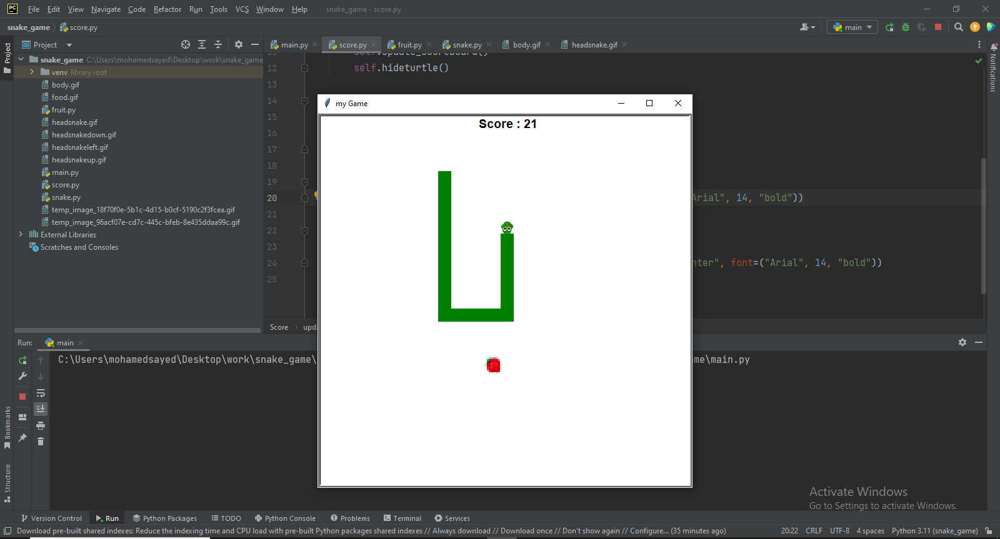

# Snake Game with Python Turtle Graphics

This is a classic Snake game created using Python's Turtle graphics library. The objective is to control a snake that grows longer as it consumes food, while avoiding collisions with itself or the walls.

**How to Play:**

1**Run:** Open a terminal or command prompt and navigate to the directory where you saved the script. Then, execute the command `python main.py`.
2**Controls:**
   - Use the arrow keys (Up, Down, Left, Right) to control the snake's direction.
3**Gameplay:**
   - The snake will start with a short length and move continuously.
   - Food (a strawberry  fruit) will appear randomly on the screen.
   - Eating food increases the snake's length by one segment.
   - The game ends when the snake collides with itself or the walls of the game area.

**Features:**

- Basic game loop and movement mechanics
- Food generation and snake growth
- Collision detection (snake with itself or walls)
- Simple score keeping (length of the snake)

- An image-editing tool (like GIMP or Photoshop) to create a custom image for the snake segment or food item (see comments in the code for details).

**Screenshot:**

This code provides a basic implementation of the Snake game. You can expand on it to incorporate more features and customizations as desired.

**Contact Information:**

For any inquiries or collaboration opportunities, you can reach out to me:

- **LinkedIn**: [LinkedIn Profile](https://www.linkedin.com/in/m7mmed-sayed/)
- **Email**: mohamedsayed1167@gmail.com